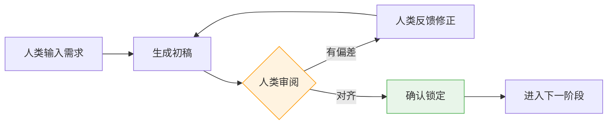
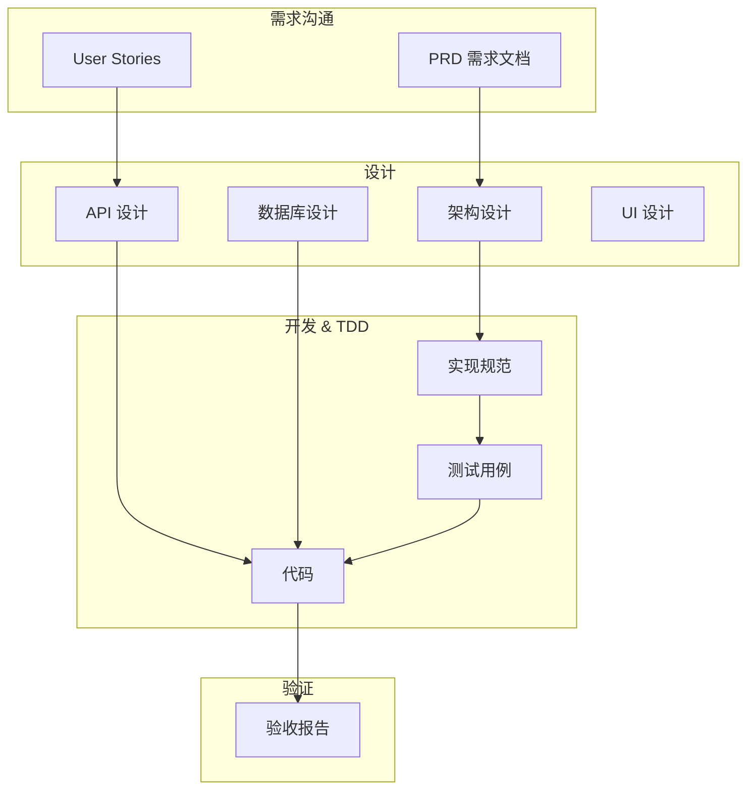

# 辅助开发工作流框架 (Assisted Development Workflow)

本文档定义了进行 Web 系统开发的完整生命周期工作流，涵盖从需求沟通到上线的全过程。

---

## 📑 目录

- [工作流总览](#工作流总览)
- [Phase 1: 需求沟通](#phase-1-需求沟通-requirement-communication)
- [Phase 2a: 后端设计](#phase-2a-后端设计-backend-design)
- [Phase 2b: 前端设计](#phase-2b-前端设计-frontend-design)
- [Phase 3: 开发与测试 (TDD)](#phase-3-开发与测试-tdd-development--testing)
- [Phase 3a: 代码评审](#phase-3a-代码评审-code-review)
- [Phase 4: 验证](#phase-4-验证-verification)
- [Phase 4a: 问题修复](#phase-4a-问题修复-bug-fix)
- [Phase 5: 迭代与上线](#phase-5-迭代与上线-iteration--release)
- [产出物格式规范](#产出物格式规范)

---

## 📁 产出物模板

每个阶段的产出物模板位于对应目录下，使用前请复制并重命名：

| 阶段        | 模板文件                                                                     | 目录                             |
| ----------- | ---------------------------------------------------------------------------- | -------------------------------- |
| 需求沟通    | [\_TEMPLATE_PRD.md](./requirements/_TEMPLATE_PRD.md)                         | `docs/requirements/`             |
| 设计-UI     | [\_TEMPLATE_UI_PROTOTYPE.md](./design/_TEMPLATE_UI_PROTOTYPE.md)             | `docs/design/`                   |
| 设计-架构   | [\_TEMPLATE_ARCHITECTURE.md](./design/_TEMPLATE_ARCHITECTURE.md)             | `docs/design/`                   |
| 设计-API    | [\_TEMPLATE_API.md](./design/_TEMPLATE_API.md)                               | `docs/design/`                   |
| 设计-数据库 | [\_TEMPLATE_DATABASE.md](./design/_TEMPLATE_DATABASE.md)                     | `docs/design/`                   |
| 设计-Schema | [\_TEMPLATE_DATABASE_SCHEMA.md](./design/_TEMPLATE_DATABASE_SCHEMA.md)       | `docs/design/DATABASE_SCHEMA.md` |
| 设计-前端   | [\_TEMPLATE_FRONTEND.md](./design/_TEMPLATE_FRONTEND.md)                     | `docs/design/`                   |
| 开发        | [\_TEMPLATE_IMPLEMENTATION.md](./implementation/_TEMPLATE_IMPLEMENTATION.md) | `docs/implementation/`           |
| 代码评审    | [\_TEMPLATE_CODE_REVIEW.md](./code_review/_TEMPLATE_CODE_REVIEW.md)          | `docs/code_review/`              |
| 测试        | [\_TEMPLATE_TESTCASE.md](./test/_TEMPLATE_TESTCASE.md)                       | `docs/test/`                     |
| 问题修复    | [\_TEMPLATE_BUGFIX.md](./bugfix/_TEMPLATE_BUGFIX.md)                         | `docs/bugfix/`                   |
| 验证        | [\_TEMPLATE_VERIFICATION.md](./verification/_TEMPLATE_VERIFICATION.md)       | `docs/verification/`             |
| 上线        | [\_TEMPLATE_RELEASE.md](./release/_TEMPLATE_RELEASE.md)                      | `docs/release/`                  |

**规范文档**:

- [DESIGN_STANDARDS.md](../.agent/rules/DESIGN_STANDARDS.md) - 设计规范
- [CODING_STANDARDS.md](../.agent/rules/CODING_STANDARDS.md) - 编码规范

**阶段流程** (位于 `.agent/workflows/`):

| 阶段      | 流程文件                                                                                   |
| --------- | ------------------------------------------------------------------------------------------ |
| 需求沟通  | [01-requirements-prompt.md](../.agent/workflows/01-requirements-prompt.md)                 |
| 设计-后端 | [02a-backend-design-prompt.md](../.agent/workflows/02a-backend-design-prompt.md)           |
| 设计-前端 | [02b-frontend-design-prompt.md](../.agent/workflows/02b-frontend-design-prompt.md)         |
| 开发-后端 | [03-backend-development-prompt.md](../.agent/workflows/03-backend-development-prompt.md)   |
| 开发-前端 | [04-frontend-development-prompt.md](../.agent/workflows/04-frontend-development-prompt.md) |
| 代码评审  | [05-code-review-prompt.md](../.agent/workflows/05-code-review-prompt.md)                   |
| 问题修复  | [06-bugfix-prompt.md](../.agent/workflows/06-bugfix-prompt.md)                             |
| 验证      | [07-verification-prompt.md](../.agent/workflows/07-verification-prompt.md)                 |
| 迭代/发布 | [08-iteration-release-prompt.md](../.agent/workflows/08-iteration-release-prompt.md)       |

---

## 工作流总览

graph LR
A[需求沟通] --> B1[后端设计]
B1 --> B2[前端设计]
B2 --> C1[后端开发]
B2 --> C2[前端开发]
C --> D[代码评审]
D --> E[验证]
E -->|通过| F[上线]
E -->|不通过| C
F -->|新需求| A

    style A fill:#e1f5fe
    style B fill:#fff3e0
    style C fill:#e8f5e9
    style D fill:#fce4ec
    style E fill:#f3e5f5
    style F fill:#e0f2f1

### 核心原则

| 原则           | 说明                                                            |
| -------------- | --------------------------------------------------------------- |
| **产出物驱动** | 每个阶段产出标准化文档，作为下一阶段的输入                      |
| **可解析**     | 所有文档使用 YAML Frontmatter + Markdown 格式，可直接读取和更新 |
| **增量迭代**   | 支持在原有产出物上迭代，而非每次重建                            |
| **可追溯性**   | 每个产出物包含版本信息和变更历史                                |

---

### ⚠️ 核心原则: 迭代沟通与对齐

> [!CAUTION] > **每个阶段都不是一次性完成的！** 必须通过多轮沟通确保人机理解一致，避免因信息不对齐导致后续大量返工。

#### 沟通循环模型



#### 每阶段对齐检查点

| 阶段         | 对齐检查点                                             | 确认方式        |
| ------------ | ------------------------------------------------------ | --------------- |
| **需求沟通** | 用户故事是否完整？验收标准是否可测？边界条件是否覆盖？ | 人类逐条确认 ✅ |
| **设计**     | 架构是否满足需求？API 契约是否合理？数据模型是否完整？ | 技术评审 ✅     |
| **开发**     | 实现是否符合设计？代码是否符合规范？                   | Code Review ✅  |
| **测试**     | 测试用例是否覆盖所有验收标准？边界场景是否覆盖？       | 测试评审 ✅     |
| **验证**     | 是否所有验收标准都通过？是否有遗漏？                   | 验收签字 ✅     |

#### 对齐确认模板

在每轮沟通后，应使用以下模板进行对齐确认：

```markdown
## 对齐确认

### 我理解的需求

[复述对需求的理解，用自己的话总结]

### 关键决策点

1. [决策 1]: [选项 A] vs [选项 B] → 我选择 [X]，因为 [理由]
2. [决策 2]: [选项 A] vs [选项 B] → **需要您确认**

### 待确认问题

1. [ ] [问题 1]?
2. [ ] [问题 2]?

### 我的假设

- 假设 1: [描述] — 如果不正确请指出
- 假设 2: [描述]

### 可能的风险

- 风险 1: [描述]

---

**请确认以上理解是否正确，或指出需要修正的地方。**
```

#### 防止信息不对齐的最佳实践

| 风险         | 预防措施                                  |
| ------------ | ----------------------------------------- |
| 理解偏差     | 先复述理解，再开始工作                    |
| 隐含假设     | 明确列出所有假设，要求人类确认            |
| 边界条件遗漏 | 主动询问边界情况、异常场景、错误处理      |
| 技术选型分歧 | 提供多个选项并说明 trade-off，让人类决策  |
| 需求蔓延     | 明确 MVP 范围，超出范围的标记为 "Phase 2" |
| 术语理解差异 | 建立项目术语表，确保人机使用相同的词汇    |

#### 阶段门禁 (Phase Gate)

> [!IMPORTANT] > **每个阶段必须获得明确的 "确认通过" 才能进入下一阶段。** 未确认的产出物不应作为下一阶段的输入。

在每个阶段产出物末尾添加确认区块：

```yaml
---
## ✅ 阶段确认

- [ ] 产出物已审阅
- [ ] 理解无偏差
- [ ] 可以进入下一阶段

**确认人**: _______________
**确认日期**: _______________
**备注**: _______________
```

#### 常见对齐失败场景及应对

| 场景                 | 问题表现                       | 应对方法                         |
| -------------------- | ------------------------------ | -------------------------------- |
| 过度假设             | 自行填充大量未说明的细节       | 要求列出所有假设供确认           |
| 人类描述模糊         | "做个好用的登录功能"           | 主动追问：什么叫好用？哪些场景？ |
| 跳过确认直接开发     | 开发完发现需求理解错误         | 强制每阶段 checkpoint            |
| 只输出结果不解释过程 | 无法判断的思路是否正确         | 要求解释决策理由                 |
| 需求变更未同步       | 设计基于旧需求，代码基于新需求 | 变更时同步更新所有关联文档       |

---

### 产出物流转图



---

## Phase 1: 需求沟通 (Requirement Communication)

### 目标

将业务需求转化为可理解的结构化需求文档。

### 流程指引

详细流程请参考: [01-requirements-prompt.md](../.agent/workflows/01-requirements-prompt.md)

### 产出物

| 模板                                                 | 输出路径                                    |
| ---------------------------------------------------- | ------------------------------------------- |
| [\_TEMPLATE_PRD.md](./requirements/_TEMPLATE_PRD.md) | `docs/requirements/{{feature-name}}-prd.md` |

### 阶段门禁

- [ ] 用户故事完整，覆盖所有功能点
- [ ] 验收标准可测试，使用 Given/When/Then 格式
- [ ] 边界条件和异常场景已覆盖
- [ ] 非功能需求已定义

---

---

## Phase 2a: 后端设计 (Backend Design)

### 目标

构建坚实的后端基础，确定 API 契约和数据结构。

### 流程指引

详细流程请参考: [02a-backend-design-prompt.md](../.agent/workflows/02a-backend-design-prompt.md)

### 产出物

| 模板                                                             | 输出路径                                       |
| ---------------------------------------------------------------- | ---------------------------------------------- |
| [\_TEMPLATE_ARCHITECTURE.md](./design/_TEMPLATE_ARCHITECTURE.md) | `docs/design/{{feature-name}}-architecture.md` |
| [\_TEMPLATE_API.md](./design/_TEMPLATE_API.md)                   | `docs/design/{{feature-name}}-api.md`          |
| [\_TEMPLATE_DATABASE.md](./design/_TEMPLATE_DATABASE.md)         | `docs/design/{{feature-name}}-database.md`     |

## Phase 2b: 前端设计 (Frontend Design)

### 目标

基于 API 契约设计用户交互和前端架构。

### 流程指引

详细流程请参考: [02b-frontend-design-prompt.md](../.agent/workflows/02b-frontend-design-prompt.md)

### 产出物

| 模板                                                             | 输出路径                                       |
| ---------------------------------------------------------------- | ---------------------------------------------- |
| [\_TEMPLATE_UI_PROTOTYPE.md](./design/_TEMPLATE_UI_PROTOTYPE.md) | `docs/design/{{feature-name}}-ui-prototype.md` |
| [\_TEMPLATE_FRONTEND.md](./design/_TEMPLATE_FRONTEND.md)         | `docs/design/{{feature-name}}-frontend.md`     |

---

## Phase 3: 开发与测试 (TDD) (Development & Testing)

### 目标

将设计转化为符合编码规范的代码实现，并采用测试驱动开发 (TDD) 确保代码质量。

### 流程指引

详细流程请参考:

- 后端: [03-backend-development-prompt.md](../.agent/workflows/03-backend-development-prompt.md)
- 前端: [04-frontend-development-prompt.md](../.agent/workflows/04-frontend-development-prompt.md)

### 产出物

| 模板                                                                         | 输出路径                                       |
| ---------------------------------------------------------------------------- | ---------------------------------------------- |
| [\_TEMPLATE_IMPLEMENTATION.md](./implementation/_TEMPLATE_IMPLEMENTATION.md) | `docs/implementation/{{feature-name}}-impl.md` |
| [\_TEMPLATE_TESTCASE.md](./test/_TEMPLATE_TESTCASE.md)                       | `docs/test/{{feature-name}}-testcase.md`       |

### 阶段门禁

- [ ] 单元测试覆盖率达标 (TDD)
- [ ] 所有代码通过 ESLint/PMD 检查
- [ ] 遵循分层架构规范
- [ ] 代码评审已通过

---

## Phase 3a: 代码评审 (Code Review)

### 目标

通过规范化的代码评审流程，确保代码质量、一致性和可维护性。

### 流程指引

详细流程请参考: [05-code-review-prompt.md](../.agent/workflows/05-code-review-prompt.md)

### 产出物

| 模板                                                                | 输出路径                                           |
| ------------------------------------------------------------------- | -------------------------------------------------- |
| [\_TEMPLATE_CODE_REVIEW.md](./code_review/_TEMPLATE_CODE_REVIEW.md) | `docs/code_review/{{YYYY-MM-DD}}/{{commit-id}}.md` |

### 阶段门禁

- [ ] 代码符合编码规范
- [ ] 无严重性能问题
- [ ] 无安全漏洞
- [ ] 评审状态为 PASS

---

## Phase 4a: 问题修复 (Bug Fix)

### 目标

分析验证或生产环境发现的问题，设计修复方案并记录决策过程。

### 核心关注点

| 关注点       | 说明                 |
| ------------ | -------------------- |
| **问题成因** | 问题是如何产生的？   |
| **解决方案** | 有哪些可行方案？     |
| **方案选择** | 为什么选择这个方案？ |
| **回归预防** | 如何确保不再复发？   |

### 流程指引

详细流程请参考: [06-bugfix-prompt.md](../.agent/workflows/06-bugfix-prompt.md)

### 产出物

| 模板                                                 | 输出路径                             |
| ---------------------------------------------------- | ------------------------------------ |
| [\_TEMPLATE_BUGFIX.md](./bugfix/_TEMPLATE_BUGFIX.md) | `docs/bugfix/{{issue-id}}-bugfix.md` |

### 阶段门禁

- [ ] 根因分析完成
- [ ] 方案选择理由已记录
- [ ] 回归测试用例已设计

---

## Phase 4: 验证 (Verification)

### 目标

确认实现满足需求，准备发布。

### 流程指引

详细流程请参考: [07-verification-prompt.md](../.agent/workflows/07-verification-prompt.md)

### 产出物

| 模板                                                                   | 输出路径                                             |
| ---------------------------------------------------------------------- | ---------------------------------------------------- |
| [\_TEMPLATE_VERIFICATION.md](./verification/_TEMPLATE_VERIFICATION.md) | `docs/verification/{{feature-name}}-verification.md` |

### 阶段门禁

- [ ] 功能验收通过
- [ ] 非功能验收通过
- [ ] 发布检查清单完成
- [ ] 验收报告已签署

---

## Phase 5: 迭代与上线 (Iteration & Release)

### 目标

支持需求迭代和版本发布。

### 流程指引

详细流程请参考: [08-iteration-release-prompt.md](../.agent/workflows/08-iteration-release-prompt.md)

### 产出物

| 模板                                                    | 输出路径                               |
| ------------------------------------------------------- | -------------------------------------- |
| [\_TEMPLATE_RELEASE.md](./release/_TEMPLATE_RELEASE.md) | `docs/release/v{{version}}-release.md` |

### 阶段门禁

- [ ] 影响分析完成
- [ ] 相关文档已更新
- [ ] 发布记录已生成
- [ ] 回滚方案已准备

---

## 产出物格式规范

### 通用 YAML Frontmatter

所有文档必须包含以下元信息，以便解析和迭代：

```yaml
---
# 文档类型: PRD | Architecture | API | Database | Implementation | TestCase | Verification | Release
docType: string

# 语义化版本号
version: "1.0.0"

# 状态: draft | review | approved | deprecated
status: string

# 创建日期
created: YYYY-MM-DD

# 最后更新日期
updated: YYYY-MM-DD

# 关联文档列表
relatedDocs:
  - type: string
    path: string
    version: string

# 变更日志
changeLog:
  - version: string
    date: YYYY-MM-DD
    changes: string
---
```

### 状态标记

在文档内容中使用以下标记指示状态：

| 标记           | 含义     | 示例                      |
| -------------- | -------- | ------------------------- |
| `[NEW]`        | 新增内容 | `### [NEW] 2.3 新功能`    |
| `[MODIFIED]`   | 修改内容 | `### [MODIFIED] 2.1 登录` |
| `[DEPRECATED]` | 废弃内容 | `### [DEPRECATED] 旧接口` |
| `[WIP]`        | 进行中   | `### [WIP] 开发中功能`    |

---

### 文档引用方式

```markdown
## 引用现有文档

请阅读以下项目文档：

**编码规范**: @file:.agent/rules/CODING_STANDARDS.md

**需求文档**: @file:docs/requirements/{{feature-x-prd}}.md

**设计文档**: @file:docs/design/{{feature-x-design}}.md

基于以上文档，请 [具体任务描述]
```

---

## 目录结构建议

```
project/
├── docs/
│   ├── requirements/           # 需求文档
│   │   └── feature-x-prd.md
│   ├── design/                 # 设计文档
│   │   ├── DATABASE_SCHEMA.md      # [核心] 数据库全量结构快照
│   │   ├── feature-x-architecture.md
│   │   ├── feature-x-api.md
│   │   └── feature-x-database.md
│   ├── implementation/         # 实现规范
│   │   └── feature-x-impl.md
│   ├── test/                   # 测试用例
│   │   └── feature-x-testcase.md
│   ├── verification/           # 验收报告
│   │   └── feature-x-verification.md
│   └── release/                # 发布记录
│       └── release-v1.0.0.md
├── .agent/rules/
│   └── CODING_STANDARDS.md  # 编码规范 (已存在)
└── ...
```

---

## 总结

本工作流框架的核心价值：

1. **标准化**: 统一的文档格式使能够准确解析和生成
2. **可追溯**: 每个阶段产出物都有明确的上下游关系
3. **可迭代**: 支持在原有产出物上进行增量更新
4. **质量保证**: 与编码规范集成，确保代码质量

使用此框架，开发团队可以与高效协作，完成从需求到上线的完整开发周期。
