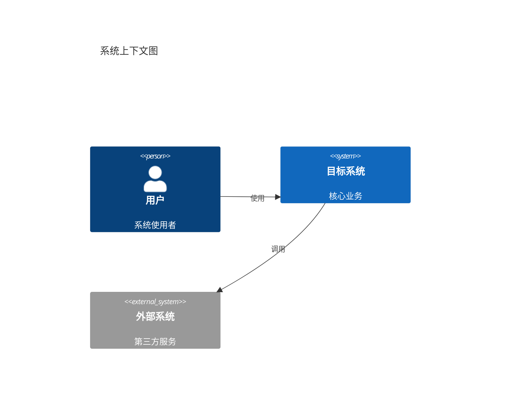

# [Feature Name] 架构设计

> **设计规范**: [ARCHITECTURE_DESIGN.md](../../.agent/rules/backend/ARCHITECTURE_DESIGN.md)

## 1. 系统上下文

---

## 2. 组件设计

### 2.1 后端组件

| 模块       | 职责     | 技术         |
| ---------- | -------- | ------------ |
| Controller | 请求处理 | Spring MVC   |
| Service    | 业务逻辑 | Spring Boot  |
| Repository | 数据访问 | MyBatis-Plus |

### 2.2 前端组件

| 组件   | 职责   | 路由  |
| ------ | ------ | ----- |
| [View] | [职责] | /path |

---

## 3. 技术决策 (ADR)

### ADR-001: [决策标题]

- **状态**: 已采纳
- **背景**: [为什么需要决策]
- **决策**: [采用的方案]
- **理由**: [选择理由]
- **后果**: [方案影响]

---

## 4. 安全设计

| 考量 | 措施         |
| ---- | ------------ |
| 认证 | JWT Token    |
| 授权 | RBAC         |
| 数据 | 敏感数据加密 |

---

## 5. 性能设计

| 指标     | 目标     | 措施   |
| -------- | -------- | ------ |
| 响应时间 | < 200ms  | 缓存   |
| 并发     | 1000 TPS | 连接池 |

---

## ✅ 阶段确认

- [ ] 架构满足需求
- [ ] 技术选型合理
- [ ] 安全风险已评估
- [ ] 可以进入详细设计

**确认人**: **\*\***\_\_\_**\*\*** **日期**: **\*\***\_\_\_**\*\***
