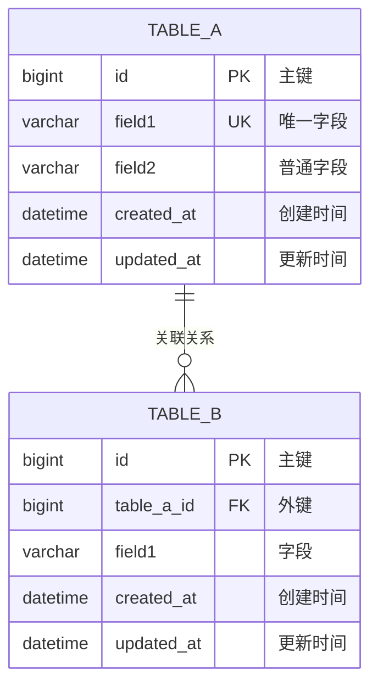

# [Feature Name] 数据库设计

> **设计规范**: [DATABASE_DESIGN.md](../../.agent/rules/backend/DATABASE_DESIGN.md) - 数据库设计部分

---

## 1. ER 图



---

## 2. 表结构设计

### 2.1 [table_name] 表

**表说明**: [表的用途说明]

| 字段       | 类型            | 约束               | 默认值                      | 说明                 |
| ---------- | --------------- | ------------------ | --------------------------- | -------------------- |
| id         | BIGINT UNSIGNED | PK, AUTO_INCREMENT | -                           | 主键                 |
| field1     | VARCHAR(50)     | UNIQUE, NOT NULL   | -                           | 字段说明             |
| field2     | VARCHAR(255)    | NOT NULL           | -                           | 字段说明             |
| status     | TINYINT         | NOT NULL           | 0                           | 状态: 0=草稿, 1=发布 |
| created_at | DATETIME        | NOT NULL           | CURRENT_TIMESTAMP           | 创建时间             |
| updated_at | DATETIME        | NOT NULL           | CURRENT_TIMESTAMP ON UPDATE | 更新时间             |
| created_by | BIGINT UNSIGNED | NULL               | -                           | 创建人               |
| updated_by | BIGINT UNSIGNED | NULL               | -                           | 更新人               |
| deleted_at | DATETIME        | NULL               | -                           | 软删除时间           |

**建表 SQL**:

```sql
CREATE TABLE [table_name] (
    id BIGINT UNSIGNED AUTO_INCREMENT PRIMARY KEY COMMENT '主键',
    field1 VARCHAR(50) NOT NULL UNIQUE COMMENT '字段说明',
    field2 VARCHAR(255) NOT NULL COMMENT '字段说明',
    status TINYINT NOT NULL DEFAULT 0 COMMENT '状态: 0=草稿, 1=发布',
    created_at DATETIME NOT NULL DEFAULT CURRENT_TIMESTAMP COMMENT '创建时间',
    updated_at DATETIME NOT NULL DEFAULT CURRENT_TIMESTAMP ON UPDATE CURRENT_TIMESTAMP COMMENT '更新时间',
    created_by BIGINT UNSIGNED COMMENT '创建人',
    updated_by BIGINT UNSIGNED COMMENT '更新人',
    deleted_at DATETIME COMMENT '软删除时间',
    INDEX idx_[table]_status (status),
    INDEX idx_[table]_created_at (created_at)
) ENGINE=InnoDB DEFAULT CHARSET=utf8mb4 COMMENT='[表说明]';
```

---

## 3. 索引设计

| 表      | 索引名                   | 字段       | 类型   | 说明     |
| ------- | ------------------------ | ---------- | ------ | -------- |
| [table] | uk\_[table]\_field1      | field1     | UNIQUE | 唯一约束 |
| [table] | idx\_[table]\_status     | status     | NORMAL | 状态查询 |
| [table] | idx\_[table]\_created_at | created_at | NORMAL | 时间查询 |

---

## 4. 数据字典

### 状态枚举

| 值  | 名称      | 说明   |
| --- | --------- | ------ |
| 0   | DRAFT     | 草稿   |
| 1   | PUBLISHED | 已发布 |
| 2   | ARCHIVED  | 已归档 |

---

## 5. 数据迁移

### V1.0.0\__create_[table].sql

```sql
-- 创建表
CREATE TABLE ...

-- 初始化数据
INSERT INTO ...
```

---

## ✅ 阶段确认

- [ ] 表结构符合规范
- [ ] 索引设计合理
- [ ] 字段类型正确
- [ ] 迁移脚本已准备

**确认人**: **\*\***\_\_\_**\*\*** **日期**: **\*\***\_\_\_**\*\***
