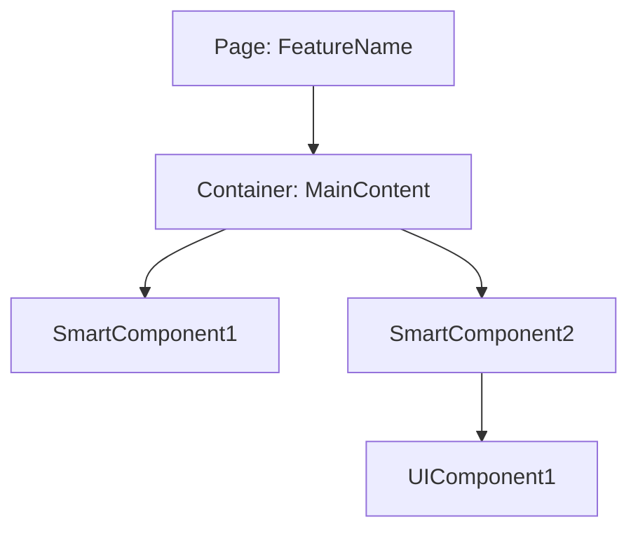
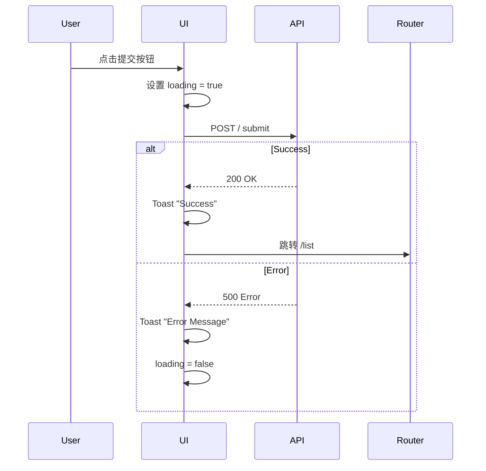

# 前端设计文档: {{Feature Name}}

> 对应 PRD: [Link to PRD]
> 对应 UI 原型: [Link to UI Prototype]

## 1. 组件架构 (Component Architecture)

### 组件树


### 组件清单
| 组件名 | 类型 (Smart/Dumb) | 职责 | Props 设计 |
| :--- | :--- | :--- | :--- |
| `UserListContainer` | Smart | 获取用户列表数据，处理筛选逻辑 | - |
| `UserTable` | Dumb | 纯展示用户表格 | `users: User[]`, `onDelete: (id) => void` |

## 2. 状态管理 (State Management)

### Global State (Zustand/Context)
- **Store Name**: `useFeatureStore`
- **Structure**:
```typescript
interface FeatureState {
  isLoading: boolean;
  data: Data[];
  filters: FilterOptions;
  fetchData: () => Promise<void>;
  updateFilter: (key: string, value: any) => void;
}
```

### Local State
- 表单状态使用 `react-hook-form`
- 模态框可见性 (`isModalOpen`)

## 3. 路由设计 (Routing)

| 路径 | 页面组件 | Loader/Action | 权限要求 |
| :--- | :--- | :--- | :--- |
| `/features` | `FeatureListPage` | `loadFeatureList` | `VIEW_FEATURE` |
| `/features/:id` | `FeatureDetailPage` | `loadFeatureDetail` | `VIEW_FEATURE` |

## 4. API 集成 (API Integration)

| 前端方法 | 对应后端 API | 错误处理策略 |
| :--- | :--- | :--- |
| `createFeature(data)` | `POST /api/v1/features` | Toast 报错 & 保持表单状态 |
| `getFeatureList(params)` | `GET /api/v1/features` | 页面级 Error Boundary 或 空状态展示 |

## 5. 交互流程 (Interaction Flows)

### 核心流程: {{Flow Name}}

