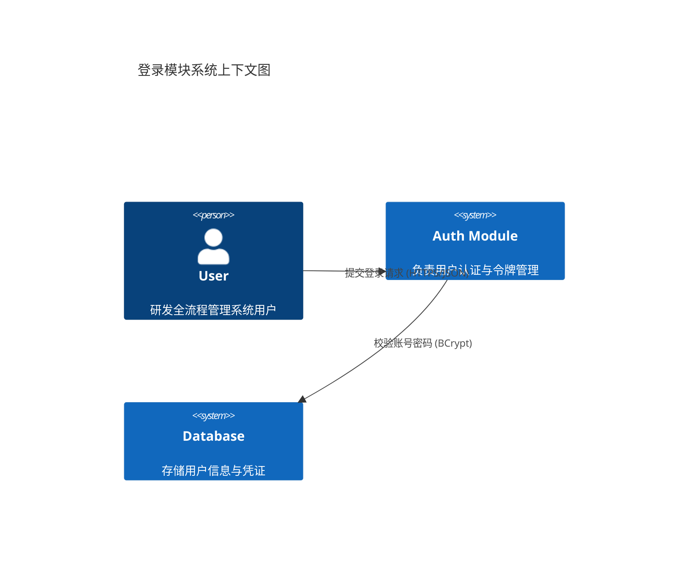

# 登录模块架构设计

> **设计规范**: [ARCHITECTURE_DESIGN.md](../../.agent/rules/backend/ARCHITECTURE_DESIGN.md)

## 1. 系统上下文

---

## 2. 组件设计

### 2.1 后端组件

| 模块           | 职责                                             | 技术                   |
| -------------- | ------------------------------------------------ | ---------------------- |
| AuthController | 暴露登录/登出 Endpoint，处理 HTTP 请求参数校验   | Spring Boot / Web      |
| AuthService    | 核心业务逻辑：验证凭证、生成 Token、处理锁定逻辑 | Spring Security / Java |
| JwtProvider    | JWT Token 的生成、解析与验证                     | jjwt / Java            |
| UserRepository | 用户数据持久化访问                               | MyBatis-Plus / MySQL   |
| UserEntity     | 数据库实体映射                                   | POJO / Lombok          |

### 2.2 前端组件

| 组件         | 职责                                    | 路由   |
| ------------ | --------------------------------------- | ------ |
| LoginPage    | 登录页面容器，包含登录表单              | /login |
| LoginForm    | 用户名/密码输入与校验组件               | -      |
| AuthProvider | 全局 Context，管理 Token 和当前用户信息 | -      |

---

## 3. 技术决策 (ADR)

### ADR-001: 认证机制选择 JWT

- **状态**: 已采纳
- **背景**: 系统需要支持前后端分离架构，且未来可能不仅限于 Web 端并需横向扩展。
- **决策**: 采用 JWT (JSON Web Token) 作为身份认证凭证。
- **理由**: 无状态，适合分布式；前端易于处理；标准成熟。
- **后果**: 服务端无法主动注销 Token（需配合黑名单或虽短有效期+Refresh Token，本期 V1.0 采用短有效期策略）。

### ADR-002: 密码存储算法

- **状态**: 已采纳
- **背景**: 必须保证用户密码安全，防止脱库破解。
- **决策**: 使用 BCrypt 或 Argon2。
- **理由**: Spring Security 默认支持 BCrypt，抗暴力破解能力强。
- **后果**: 验证密码消耗少量 CPU 资源，需注意性能（通常不是瓶颈）。

---

## 4. 安全设计

| 考量       | 措施                                                  |
| ---------- | ----------------------------------------------------- |
| 传输安全   | 强制 HTTPS 全程加密                                   |
| 凭证安全   | 下发 Token 时不包含敏感信息（仅 UserID/Role）         |
| 防暴力破解 | 连续失败 5 次锁定账号 15 分钟（Redis 计数或 DB 字段） |
| 存储安全   | 密码加盐 Hash (BCrypt)                                |

---

## 5. 性能设计

| 指标     | 目标    | 措施                          |
| -------- | ------- | ----------------------------- |
| 登录响应 | < 500ms | 数据库索引优化 (idx_username) |
| 并发支持 | 100 TPS | 服务无状态设计                |

---

## ✅ 阶段确认

- [ ] 架构满足需求
- [ ] 技术选型合理
- [ ] 安全风险已评估
- [ ] 可以进入详细设计
