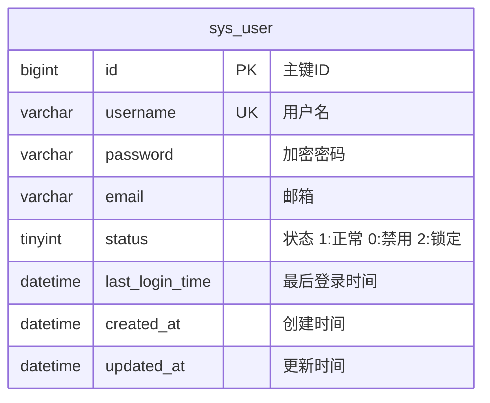

# 登录模块数据库设计

> **设计规范**: [DATABASE_DESIGN.md](../../.agent/rules/backend/DATABASE_DESIGN.md)

---

## 1. ER 图



---

## 2. 表结构设计

### 2.1 sys_user 表

**表说明**: 系统用户表，存储所有登录账号信息。

| 字段             | 类型            | 约束               | 默认值                      | 说明                   |
| ---------------- | --------------- | ------------------ | --------------------------- | ---------------------- |
| id               | BIGINT UNSIGNED | PK, AUTO_INCREMENT | -                           | 主键                   |
| username         | VARCHAR(50)     | UNIQUE, NOT NULL   | -                           | 用户名                 |
| password         | VARCHAR(100)    | NOT NULL           | -                           | BCrypt 加密密码        |
| email            | VARCHAR(100)    | NULL               | -                           | 邮箱                   |
| status           | TINYINT         | NOT NULL           | 1                           | 1:正常, 0:禁用, 2:锁定 |
| failed_attempts  | INT             | DEFAULT 0          | 0                           | 连续失败次数           |
| lock_expire_time | DATETIME        | NULL               | -                           | 锁定过期时间           |
| last_login_time  | DATETIME        | NULL               | -                           | 最后登录时间           |
| created_at       | DATETIME        | NOT NULL           | CURRENT_TIMESTAMP           | 创建时间               |
| updated_at       | DATETIME        | NOT NULL           | CURRENT_TIMESTAMP ON UPDATE | 更新时间               |
| created_by       | BIGINT UNSIGNED | NULL               | -                           | 创建人 ID              |
| updated_by       | BIGINT UNSIGNED | NULL               | -                           | 更新人 ID              |
| deleted_at       | DATETIME        | NULL               | -                           | 软删除时间             |

**建表 SQL**:

```sql
CREATE TABLE sys_user (
    id BIGINT UNSIGNED AUTO_INCREMENT PRIMARY KEY COMMENT '主键ID'
    , username VARCHAR(50) NOT NULL UNIQUE COMMENT '用户名'
    , password VARCHAR(100) NOT NULL COMMENT '加密密码'
    , email VARCHAR(100) DEFAULT NULL COMMENT '邮箱'
    , status TINYINT NOT NULL DEFAULT 1 COMMENT '状态: 1=正常, 0=禁用, 2=锁定'
    , failed_attempts INT DEFAULT 0 COMMENT '连续失败次数'
    , lock_expire_time DATETIME DEFAULT NULL COMMENT '锁定过期时间'
    , last_login_time DATETIME DEFAULT NULL COMMENT '最后登录时间'
    , created_at DATETIME NOT NULL DEFAULT CURRENT_TIMESTAMP COMMENT '创建时间'
    , updated_at DATETIME NOT NULL DEFAULT CURRENT_TIMESTAMP ON UPDATE CURRENT_TIMESTAMP COMMENT '更新时间'
    , created_by BIGINT UNSIGNED COMMENT '创建人ID'
    , updated_by BIGINT UNSIGNED COMMENT '更新人ID'
    , deleted_at DATETIME DEFAULT NULL COMMENT '软删除标记'
    , INDEX idx_user_username (username)
    , INDEX idx_user_status (status)
) ENGINE=InnoDB DEFAULT CHARSET=utf8mb4 COMMENT='系统用户表';
```

---

## 3. 索引设计

| 表       | 索引名      | 字段     | 类型   | 说明       |
| -------- | ----------- | -------- | ------ | ---------- |
| sys_user | uk_username | username | UNIQUE | 用户名唯一 |
| sys_user | idx_status  | status   | NORMAL | 状态查询   |

---

## 4. 数据迁移

### V20260116001\_\_create_sys_user.sql

```sql
-- 创建用户表
CREATE TABLE sys_user (
    id BIGINT UNSIGNED AUTO_INCREMENT PRIMARY KEY COMMENT '主键ID',
    username VARCHAR(50) NOT NULL UNIQUE COMMENT '用户名',
    password VARCHAR(100) NOT NULL COMMENT '加密密码',
    email VARCHAR(100) DEFAULT NULL COMMENT '邮箱',
    status TINYINT NOT NULL DEFAULT 1 COMMENT '状态: 1=正常, 0=禁用, 2=锁定',
    failed_attempts INT DEFAULT 0 COMMENT '连续失败次数',
    lock_expire_time DATETIME DEFAULT NULL COMMENT '锁定过期时间',
    last_login_time DATETIME DEFAULT NULL COMMENT '最后登录时间',
    created_at DATETIME NOT NULL DEFAULT CURRENT_TIMESTAMP COMMENT '创建时间',
    updated_at DATETIME NOT NULL DEFAULT CURRENT_TIMESTAMP ON UPDATE CURRENT_TIMESTAMP COMMENT '更新时间',
    created_by BIGINT UNSIGNED COMMENT '创建人ID',
    updated_by BIGINT UNSIGNED COMMENT '更新人ID',
    deleted_at DATETIME DEFAULT NULL COMMENT '软删除标记',
    INDEX idx_user_status (status)
) ENGINE=InnoDB DEFAULT CHARSET=utf8mb4 COMMENT='系统用户表';

-- 初始化管理员账号 (admin / admin123)
-- 注意：实际生产环境密码需用 BCrypt 生成，此处仅为示例 'admin123' 的假 Hash
INSERT INTO sys_user (username, password, status)
VALUES ('admin', '$2a$10$N9qo8uLOickgx2ZMRZoMyeIjZAgcfl7p92ldGxad68LJZdL17lhWy', 1);
```

---

## ✅ 阶段确认

- [ ] 表结构符合规范
- [ ] 索引设计合理
- [ ] 字段类型正确
- [ ] 迁移脚本已准备
