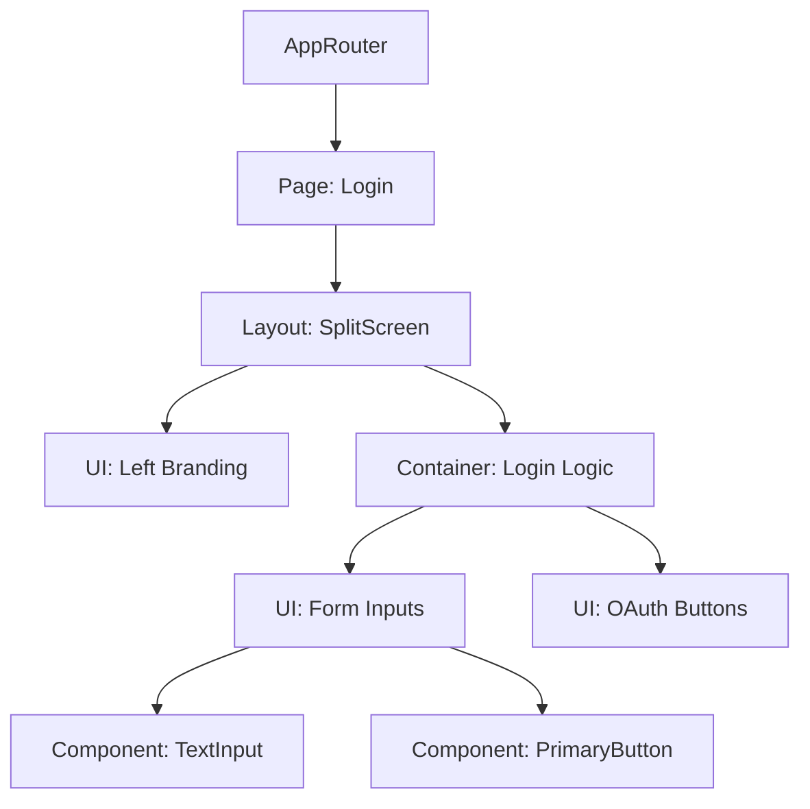
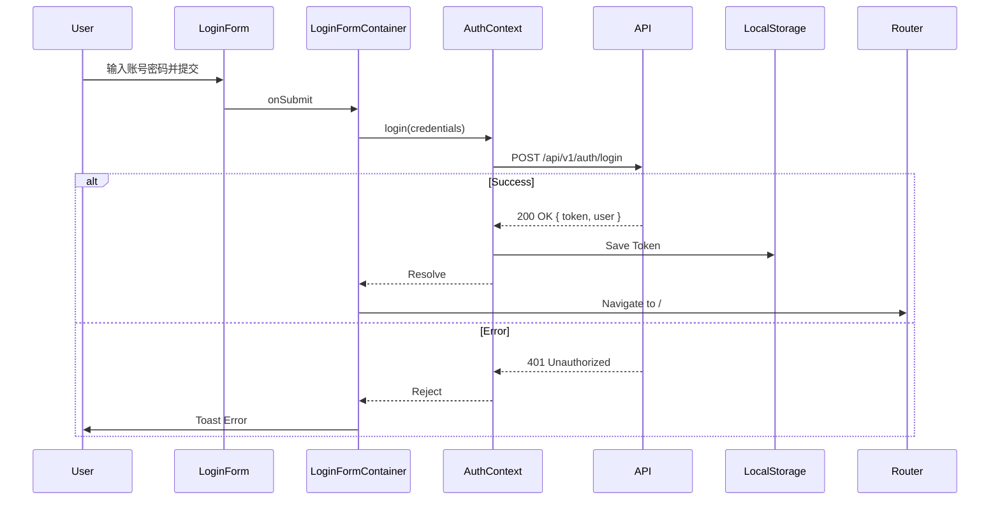

# 前端设计文档: 登录模块

> 对应 UI 原型: [login-ui-prototype.md](./login-ui-prototype.md)
> 对应 API: [login-api.md](./login-api.md)

## 1. 组件架构 (Component Architecture)

### 组件树



### 组件清单

| 组件名               | 类型  | 职责                                 | Props 设计                        |
| :------------------- | :---- | :----------------------------------- | :-------------------------------- |
| `LoginPage`          | Smart | 路由入口，负责页面 Title             | -                                 |
| `LoginFormContainer` | Smart | 处理表单提交、Loading 状态、API 调用 | -                                 |
| `BrandingSection`    | Dumb  | 展示左侧动画和 Slogan                | -                                 |
| `LoginForm`          | Dumb  | 纯展示表单 UI，接收 register/errors  | `onSubmit`, `isLoading`, `errors` |

## 2. 状态管理 (State Management)

### Global State (Context)

- **Store Name**: `AuthContext`
- **Structure**:

```typescript
interface AuthState {
  isAuthenticated: boolean;
  user: User | null;
  token: string | null;
  login: (credentials) => Promise<void>;
  logout: () => void;
}
```

### Local State

- `LoginFormContainer`:
  - 使用 `react-hook-form` 管理表单数据 (email, password)。
  - `isLoading`: boolean (提交中)。

## 3. 路由设计 (Routing)

| 路径     | 页面组件    | 权限要求                          |
| :------- | :---------- | :-------------------------------- |
| `/login` | `LoginPage` | Public (Only for Unauthenticated) |
| `/`      | `Dashboard` | Private (Auth Guard)              |

## 4. API 集成 (API Integration)

| 前端方法                                    | 对应后端 API               | 错误处理策略                      |
| :------------------------------------------ | :------------------------- | :-------------------------------- |
| `authService.login({ username, password })` | `POST /api/v1/auth/login`  | Catch 401: Toast "账号或密码错误" |
| `authService.logout()`                      | `POST /api/v1/auth/logout` | 清除 LocalStorage 并跳转 /login   |

## 5. 交互流程 (Interaction Flows)

### 登录流程


