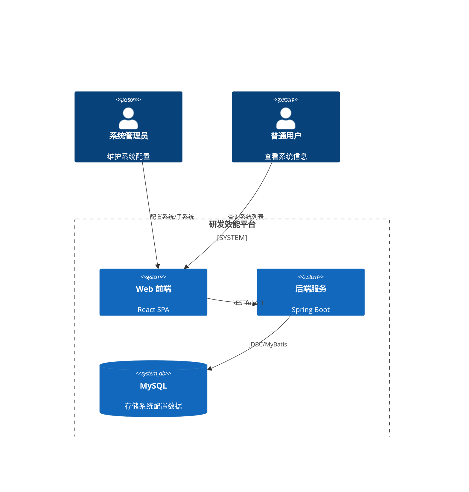
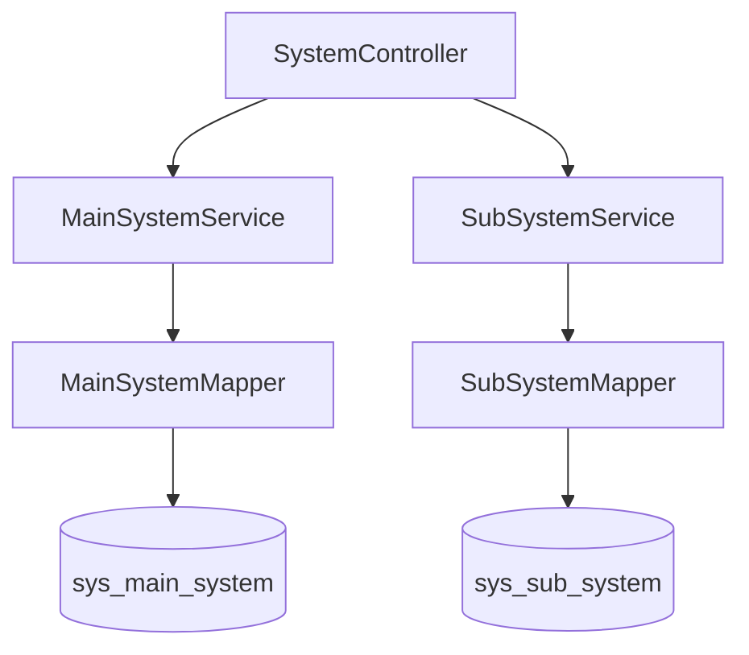

# 架构设计: 系统配置 (System Configuration)

> 对应 PRD: [system-configuration-prd.md](../requirements/system-configuration-prd.md)

## 1. C4 系统上下文 (System Context)

## 2. 组件设计 (Component Design)

### 2.1 后端组件

| 组件                | 职责                                                          |
| :------------------ | :------------------------------------------------------------ |
| `SystemController`  | 统一暴露 `/api/v1/main-systems` 和 `/api/v1/sub-systems` 接口 |
| `MainSystemService` | 处理一级系统的 CRUD 逻辑                                      |
| `SubSystemService`  | 处理子系统的 CRUD 逻辑，校验主系统存在性                      |
| `MainSystemMapper`  | `sys_main_system` 表访问                                      |
| `SubSystemMapper`   | `sys_sub_system` 表访问                                       |

### 2.2 数据模型调整 (ADR)

> **决策**: 将原有的单表树形结构拆分为 `sys_main_system` 和 `sys_sub_system` 两张表。

- **背景**: 之前的单表树形结构虽然灵活，但无法满足“主系统”和“子系统”在业务属性上的差异（如子系统必填 Git 地址，主系统不需要）。此外，用户明确要求在 UI 上分开管理。
- **决定**: 拆分为两张表。
- **后果**:
  - (+) 业务模型更清晰，属性约束并在数据库层面实施（如 `sys_sub_system.git_url` NOT NULL）。
  - (-) 不再支持无限层级（需求已确认仅需两级）。
  - (-) 所有的 CRUD 接口和前端页面需要分别实现。

## 3. 安全设计

- **RBAC**:
  - `POST/PUT/DELETE`: 仅 `ROLE_ADMIN` 可操作。
  - `GET`: `ROLE_USER` 可访问。

## 4. 性能设计

- **索引优化**:
  - `sys_sub_system` 表在 `main_system_id` 上建立索引，优化按主系统查询子系统的性能。
  - 两个表均在 `code` 字段建立唯一索引。
