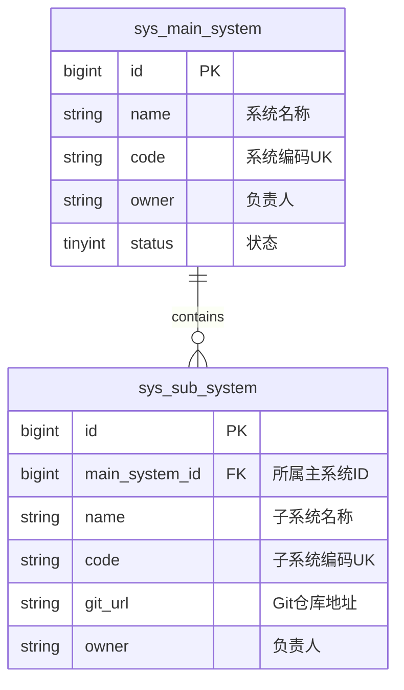

# 数据库设计: 系统配置 (System Configuration)

> 对应 PRD: [system-configuration-prd.md](../requirements/system-configuration-prd.md)
> 对应 API: [system-configuration-api.md](./system-configuration-api.md)

## 1. 实体关系图 (ER Diagram)



## 2. 表结构定义

### 2.1 主系统表 `sys_main_system`

| 字段名      | 类型            | 长度 | 必填 | 默认值            | 说明                 |
| :---------- | :-------------- | :--- | :--- | :---------------- | :------------------- |
| id          | bigint unsigned | 20   | 是   | AUTO_INCREMENT    | 主键                 |
| name        | varchar         | 50   | 是   | -                 | 系统名称             |
| code        | varchar         | 50   | 是   | -                 | 系统编码 (唯一)      |
| description | varchar         | 255  | 否   | -                 | 描述                 |
| owner       | varchar         | 50   | 否   | -                 | 系统负责人           |
| status      | tinyint         | 4    | 是   | 1                 | 状态: 1=启用, 0=禁用 |
| created_at  | datetime        | -    | 是   | CURRENT_TIMESTAMP | 创建时间             |
| updated_at  | datetime        | -    | 是   | CURRENT_TIMESTAMP | 更新时间             |
| created_by  | bigint unsigned | 20   | 否   | -                 | 创建人               |
| updated_by  | bigint unsigned | 20   | 否   | -                 | 更新人               |
| deleted_at  | datetime        | -    | 否   | NULL              | 软删除时间           |

**索引设计**:

- `uk_sys_main_system_code` (`code`, `deleted_at`) - 唯一索引

### 2.2 子系统表 `sys_sub_system`

| 字段名         | 类型            | 长度 | 必填 | 默认值            | 说明                 |
| :------------- | :-------------- | :--- | :--- | :---------------- | :------------------- |
| id             | bigint unsigned | 20   | 是   | AUTO_INCREMENT    | 主键                 |
| main_system_id | bigint unsigned | 20   | 是   | -                 | 所属主系统 ID        |
| name           | varchar         | 50   | 是   | -                 | 子系统名称           |
| code           | varchar         | 50   | 是   | -                 | 子系统编码 (唯一)    |
| description    | varchar         | 255  | 否   | -                 | 描述                 |
| git_url        | varchar         | 255  | 是   | -                 | Git 仓库地址         |
| owner          | varchar         | 50   | 否   | -                 | 子系统负责人         |
| status         | tinyint         | 4    | 是   | 1                 | 状态: 1=启用, 0=禁用 |
| created_at     | datetime        | -    | 是   | CURRENT_TIMESTAMP | 创建时间             |
| updated_at     | datetime        | -    | 是   | CURRENT_TIMESTAMP | 更新时间             |
| created_by     | bigint unsigned | 20   | 否   | -                 | 创建人               |
| updated_by     | bigint unsigned | 20   | 否   | -                 | 更新人               |
| deleted_at     | datetime        | -    | 否   | NULL              | 软删除时间           |

**索引设计**:

- `uk_sys_sub_system_code` (`code`, `deleted_at`) - 唯一索引
- `idx_sys_sub_system_main_id` (`main_system_id`) - 普通索引

## 3. 数据字典 (Enums)

无

## 4. 迁移脚本 (Migration Script)

### V20260117002\_\_create_system_tables.sql

```sql
-- 创建主系统表
CREATE TABLE `sys_main_system` (
  `id` bigint(20) unsigned NOT NULL AUTO_INCREMENT COMMENT '主键',
  `name` varchar(50) NOT NULL COMMENT '系统名称',
  `code` varchar(50) NOT NULL COMMENT '系统编码',
  `description` varchar(255) DEFAULT NULL COMMENT '描述',
  `owner` varchar(50) DEFAULT NULL COMMENT '负责人',
  `status` tinyint(4) NOT NULL DEFAULT '1' COMMENT '状态: 1=启用, 0=禁用',
  `created_at` datetime NOT NULL DEFAULT CURRENT_TIMESTAMP COMMENT '创建时间',
  `updated_at` datetime NOT NULL DEFAULT CURRENT_TIMESTAMP ON UPDATE CURRENT_TIMESTAMP COMMENT '更新时间',
  `created_by` bigint(20) unsigned DEFAULT NULL COMMENT '创建人',
  `updated_by` bigint(20) unsigned DEFAULT NULL COMMENT '更新人',
  `deleted_at` datetime DEFAULT NULL COMMENT '软删除时间',
  PRIMARY KEY (`id`),
  UNIQUE KEY `uk_sys_main_system_code` (`code`, `deleted_at`)
) ENGINE=InnoDB DEFAULT CHARSET=utf8mb4 COMMENT='主系统表';

-- 创建子系统表
CREATE TABLE `sys_sub_system` (
  `id` bigint(20) unsigned NOT NULL AUTO_INCREMENT COMMENT '主键',
  `main_system_id` bigint(20) unsigned NOT NULL COMMENT '所属主系统ID',
  `name` varchar(50) NOT NULL COMMENT '子系统名称',
  `code` varchar(50) NOT NULL COMMENT '子系统编码',
  `description` varchar(255) DEFAULT NULL COMMENT '描述',
  `git_url` varchar(255) NOT NULL COMMENT 'Git仓库地址',
  `owner` varchar(50) DEFAULT NULL COMMENT '负责人',
  `status` tinyint(4) NOT NULL DEFAULT '1' COMMENT '状态: 1=启用, 0=禁用',
  `created_at` datetime NOT NULL DEFAULT CURRENT_TIMESTAMP COMMENT '创建时间',
  `updated_at` datetime NOT NULL DEFAULT CURRENT_TIMESTAMP ON UPDATE CURRENT_TIMESTAMP COMMENT '更新时间',
  `created_by` bigint(20) unsigned DEFAULT NULL COMMENT '创建人',
  `updated_by` bigint(20) unsigned DEFAULT NULL COMMENT '更新人',
  `deleted_at` datetime DEFAULT NULL COMMENT '软删除时间',
  PRIMARY KEY (`id`),
  UNIQUE KEY `uk_sys_sub_system_code` (`code`, `deleted_at`),
  KEY `idx_sys_sub_system_main_id` (`main_system_id`)
) ENGINE=InnoDB DEFAULT CHARSET=utf8mb4 COMMENT='子系统表';
```
