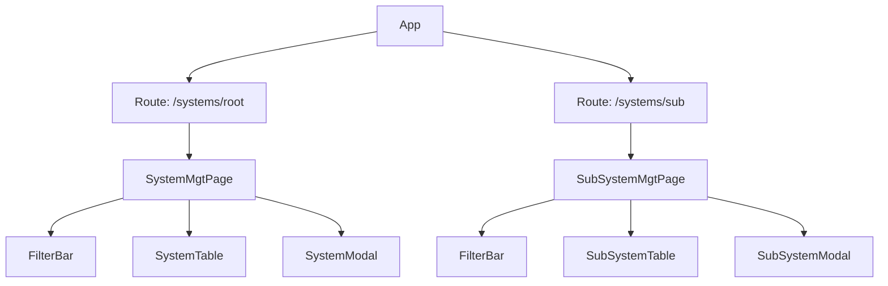
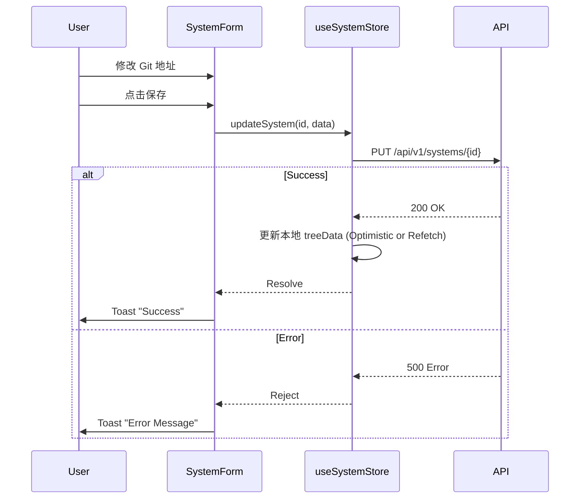

# 前端设计文档: 系统配置 (System Configuration)

> 对应 PRD: [system-configuration-prd.md](../requirements/system-configuration-prd.md)
> 对应 UI 原型: [system-configuration-ui-prototype.md](./system-configuration-ui-prototype.md)

## 1. 组件架构 (Component Architecture)

### 组件树

### 组件树



### 组件清单

### 组件清单

| 组件名             | 类型  | 职责                         | Props 设计                              |
| :----------------- | :---- | :--------------------------- | :-------------------------------------- |
| `SystemMgtPage`    | Page  | 系统管理页，加载一级系统列表 | -                                       |
| `SubSystemMgtPage` | Page  | 子系统管理页，加载子系统列表 | -                                       |
| `SystemTable`      | Smart | 列表展示、分页、操作列       | `data`, `loading`, `onEdit`, `onDelete` |
| `SystemModal`      | Dumb  | 新增/编辑系统弹窗            | `visible`, `initialValues`, `onSubmit`  |

## 2. 状态管理 (State Management)

### Global State (Zustand)

### Global State (Zustand)

- **Store Name**: `useSystemStore`
- **Structure**:

```typescript
interface MainSystem {
  id: number;
  name: string;
  code: string;
  owner?: string;
  // ...
}

interface SubSystem {
  id: number;
  mainSystemId: number;
  name: string;
  code: string;
  gitUrl: string;
  owner?: string;
}

interface SystemStore {
  // Main System State
  mainSystems: MainSystem[];
  totalMain: number;
  loadingMain: boolean;

  // Sub System State
  subSystems: SubSystem[];
  totalSub: number;
  loadingSub: boolean;

  // Actions
  fetchMainSystems: (params: PageParams) => Promise<void>;
  createMainSystem: (data: MainSystemCreateReq) => Promise<void>;
  updateMainSystem: (id: number, data: MainSystemUpdateReq) => Promise<void>;
  deleteMainSystem: (id: number) => Promise<void>;

  fetchSubSystems: (params: SubSystemQueryParams) => Promise<void>;
  createSubSystem: (data: SubSystemCreateReq) => Promise<void>;
  updateSubSystem: (id: number, data: SubSystemUpdateReq) => Promise<void>;
  deleteSubSystem: (id: number) => Promise<void>;
}
```

### Local State

- `SystemForm`: 表单脏检查 (`isDirty`)，用于离开页面前的提示。
- `TreeSearchInput`: 本地过滤树节点的搜索关键词。

## 3. 路由设计 (Routing)

| 路径            | 页面组件           | 权限要求             |
| :-------------- | :----------------- | :------------------- |
| `/systems/root` | `SystemMgtPage`    | `VIEW_SYSTEM_CONFIG` |
| `/systems/sub`  | `SubSystemMgtPage` | `VIEW_SYSTEM_CONFIG` |

## 4. API 集成 (API Integration)

| 前端方法                     | 对应后端 API                       | 错误处理策略     |
| :--------------------------- | :--------------------------------- | :--------------- |
| **Main System**              |                                    |                  |
| `fetchMainSystems(params)`   | `GET /api/v1/main-systems`         | Table Loading    |
| `createMainSystem(data)`     | `POST /api/v1/main-systems`        | Global Toast     |
| `updateMainSystem(id, data)` | `PUT /api/v1/main-systems/{id}`    | Global Toast     |
| `deleteMainSystem(id)`       | `DELETE /api/v1/main-systems/{id}` | Confirm -> Toast |
| **Sub System**               |                                    |                  |
| `fetchSubSystems(params)`    | `GET /api/v1/sub-systems`          | Table Loading    |
| `createSubSystem(data)`      | `POST /api/v1/sub-systems`         | Global Toast     |
| `updateSubSystem(id, data)`  | `PUT /api/v1/sub-systems/{id}`     | Global Toast     |
| `deleteSubSystem(id)`        | `DELETE /api/v1/sub-systems/{id}`  | Confirm -> Toast |

## 5. 交互流程 (Interaction Flows)

### 核心流程: 更新系统信息


