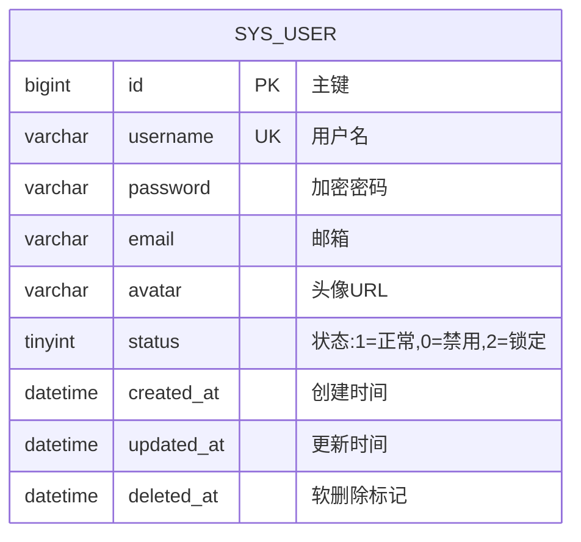

# 用户管理 (User Management) 数据库设计

> **设计规范**: [DATABASE_DESIGN.md](../../.agent/rules/backend/DATABASE_DESIGN.md)

## 1. ER 图



---

## 2. 表结构设计

### 2.1 sys_user 表

**表说明**: 系统用户表 (已存在，本次新增 avatar 字段)

| 字段       | 类型             | 约束               | 默认值                      | 说明                         |
| ---------- | ---------------- | ------------------ | --------------------------- | ---------------------------- |
| id         | BIGINT UNSIGNED  | PK, AUTO_INCREMENT | -                           | 主键 ID                      |
| username   | VARCHAR(50)      | UNIQUE, NOT NULL   | -                           | 用户名                       |
| password   | VARCHAR(100)     | NOT NULL           | -                           | 加密密码                     |
| email      | VARCHAR(100)     | DEFAULT NULL       | -                           | 邮箱                         |
| **avatar** | **VARCHAR(255)** | **DEFAULT NULL**   | **-**                       | **[NEW] 用户头像**           |
| status     | TINYINT          | NOT NULL           | 1                           | 状态: 1=正常, 0=禁用, 2=锁定 |
| created_at | DATETIME         | NOT NULL           | CURRENT_TIMESTAMP           | 创建时间                     |
| updated_at | DATETIME         | NOT NULL           | CURRENT_TIMESTAMP ON UPDATE | 更新时间                     |
| deleted_at | DATETIME         | DEFAULT NULL       | -                           | 软删除标记                   |

---

## 3. 索引设计

| 表       | 索引名          | 字段     | 类型   | 说明                 |
| -------- | --------------- | -------- | ------ | -------------------- |
| sys_user | uk_username     | username | UNIQUE | 用户名唯一           |
| sys_user | idx_user_status | status   | NORMAL | 状态查询             |
| sys_user | idx_user_email  | email    | NORMAL | 邮箱查询（建议新增） |

---

## 4. 数据迁移

### V20260117001\_\_alter_sys_user_add_avatar.sql

```sql
-- 为 sys_user 表添加 avatar 字段
ALTER TABLE sys_user
ADD COLUMN avatar VARCHAR(255) DEFAULT NULL COMMENT '用户头像' AFTER email;

-- 添加邮箱索引（如果尚未存在）
-- ALTER TABLE sys_user ADD INDEX idx_user_email (email);
```

---

## ✅ 阶段确认

- [ ] 表结构符合规范
- [ ] 索引设计合理
- [ ] 字段类型正确
- [ ] 迁移脚本已准备

**确认人**: ******\_\_\_****** **日期**: ******\_\_\_******
