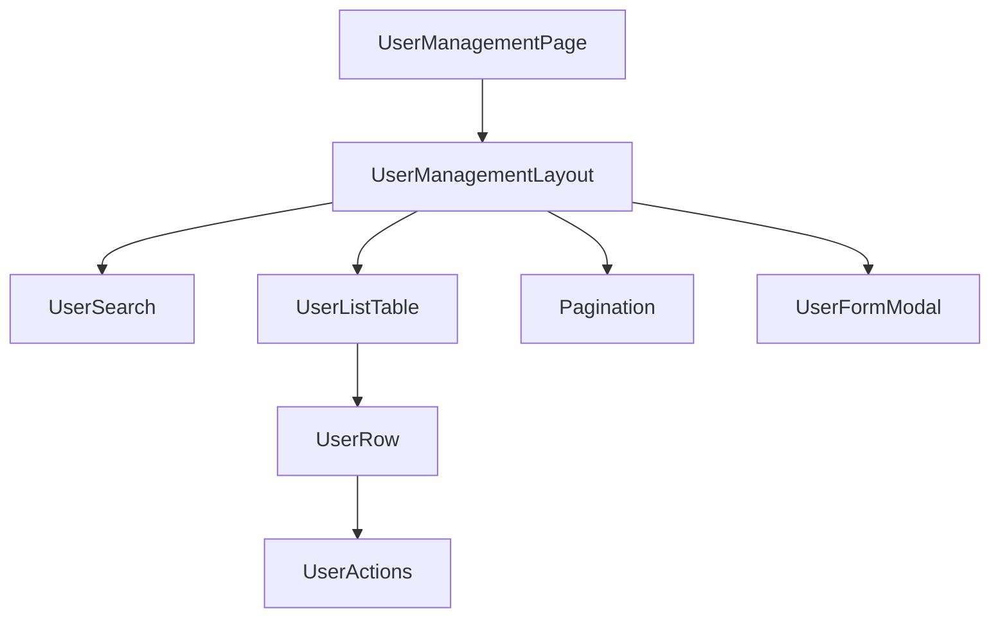
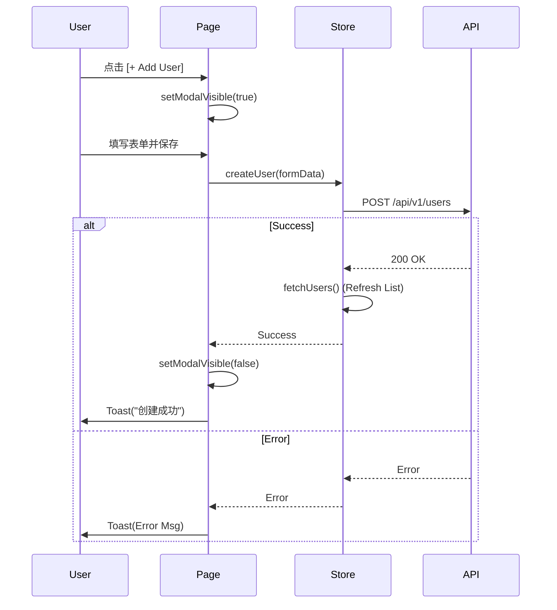

# 前端设计文档: 用户管理 (User Management)

> 对应 UI 原型: [user-management-ui-prototype.md](./user-management-ui-prototype.md)

## 1. 组件架构 (Component Architecture)

### 组件树



### 组件清单

| 组件名               | 类型 (Smart/Dumb) | 职责                                                     | Props 设计                                                         |
| :------------------- | :---------------- | :------------------------------------------------------- | :----------------------------------------------------------------- |
| `UserManagementPage` | Smart             | 路由入口，持有 `useUserStore` 状态，协调搜索、翻页、弹窗 | -                                                                  |
| `UserSearch`         | Dumb              | 搜索栏展示，回传 keyword                                 | `onSearch: (val: string) => void`                                  |
| `UserListTable`      | Dumb              | 展示用户列表，处理排序                                   | `data: User[]`, `loading: boolean`, `onAction: (type, id) => void` |
| `UserFormModal`      | Smart/Dumb        | 新增/编辑表单，处理提交逻辑 (或由 Page 控制)             | `visible`, `initialValues`, `onSubmit`                             |

## 2. 状态管理 (State Management)

### Global State (Zustand)

- **Store Name**: `useUserStore`
- **Structure**:

```typescript
interface UserState {
  // Data
  users: User[];
  total: number;
  loading: boolean;
  filters: {
    page: number;
    size: number;
    keyword: string;
  };

  // Actions
  fetchUsers: () => Promise<void>; // 自动读取 filters
  setFilter: (patch: Partial<filters>) => void;
  createUser: (data: UserForm) => Promise<void>;
  updateUser: (id: number, data: UserForm) => Promise<void>;
  deleteUser: (id: number) => Promise<void>;
  resetPassword: (id: number) => Promise<void>;
}
```

### Local State

- `UserFormModal` 内部使用 `react-hook-form` 管理表单校验和状态。
- 确认弹窗 (Confirm Dialog) 的可见性可作为 `UserManagementPage` 的 Local State。

## 3. 路由设计 (Routing)

| 路径            | 页面组件             | Loader/Action | 权限要求     |
| :-------------- | :------------------- | :------------ | :----------- |
| `/system/users` | `UserManagementPage` | -             | `ROLE_ADMIN` |

## 4. API 集成 (API Integration)

> 此处调用 `src/utils/request.ts` 封装实例

| 前端方法             | 对应后端 API                             | 错误处理策略                  |
| :------------------- | :--------------------------------------- | :---------------------------- |
| `queryUsers(params)` | `GET /api/v1/users`                      | 页面局部 Error State 或 Empty |
| `addUser(data)`      | `POST /api/v1/users`                     | Modal 内报错 (Toast)          |
| `editUser(id, data)` | `PUT /api/v1/users/{id}`                 | Modal 内报错 (Toast)          |
| `removeUser(id)`     | `DELETE /api/v1/users/{id}`              | Toast 报错                    |
| `resetPwd(id)`       | `POST /api/v1/users/{id}/reset-password` | Toast 报错                    |

## 5. 交互流程 (Interaction Flows)

### 核心流程: 新增用户


